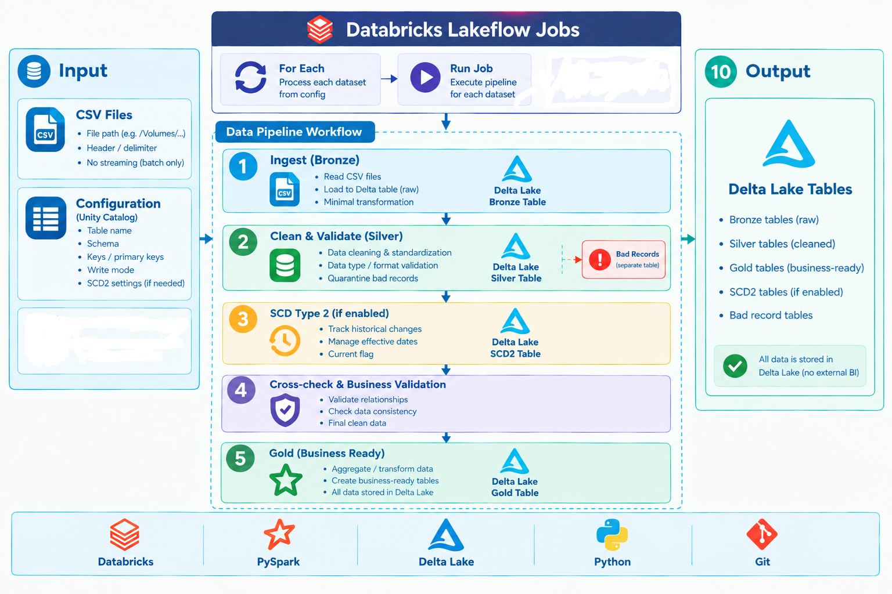
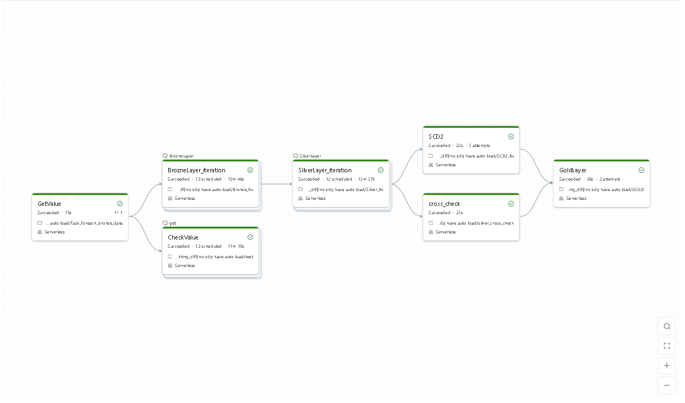

# 1. Databricks Config-Driven Data Pipeline

An end-to-end batch data engineering project built with Databricks, PySpark, Delta Lake, and Lakeflow Jobs. It processes multiple retail datasets through reusable Bronze and Silver `for_each_task` iterations, performs data quality checks, and publishes Gold KPI tables.

## 2. Overview

Pipeline metadata is stored in a Unity Catalog config table, allowing Bronze and Silver processing to be parameterized by source. The sample datasets include orders, customers, products, payments, returns, stores, and suppliers.

**Project focus:** workflow orchestration, config-driven processing, data quality handling, SCD Type 2, and analytics-ready outputs.

## 3. Architecture





The pipeline follows a Medallion architecture:

```text
CSV files + Unity Catalog config
                ↓
       Bronze → Silver
                ↓
       SCD Type 2 + Cross-check
                ↓
         Gold KPI tables
```

## 4. Key Features

- Config-driven Bronze and Silver processing using Unity Catalog metadata.
- Parallel source processing with Lakeflow Jobs `for_each_task`.
- Medallion layers backed by Delta tables.
- Silver data quality checks for invalid values, null keys, and duplicates.
- Separate bad-record outputs with rejection reasons.
- SCD Type 2 processing for historical changes.
- Gold KPI outputs for store repeat purchases and category returns.
- Databricks Asset Bundles with `dev` and `prod` targets.

## 5. Data Pipeline Workflow

| Task | Notebook | Dependency | Description |
| --- | --- | --- | --- |
| `GetValue` | `src/Bronze/Task_foreach_bronze_data.py` | None | Reads config rows and publishes task values. |
| `BrozneLayer` (`for_each`) | `src/Bronze/Bronze_fw.py` | `GetValue` | Processes each configured source into a Bronze table. |
| `SilverLayer` (`for_each`) | `src/Silver/Silver_fw.py` | `BrozneLayer` | Validates and writes good and bad records for each source. |
| `SCD2` | `src/Silver/SCD2_fw.py` | `SilverLayer` | Runs the SCD Type 2 task. |
| `cross_check` | `src/Silver/silver_cross_check.py` | `SilverLayer` | Runs cross-check validation. |
| `GoldLayer` | `src/Gold/GOLD.py` | `SCD2`, `cross_check` | Publishes Gold KPI tables after both dependencies complete. |
| `get` (`for_each`, inner task `CheckValue`) | `src/test.py` | `GetValue` | Checks config values, with concurrency set to two. |

`BrozneLayer` is the task key as currently spelled in `resources/workflow.yml`.

## 6. Project Structure

```text
.
├── .github/workflows/pipeline.yml       # GitHub Actions CI/CD workflow
├── config_table/ddl.py                  # Create catalog objects and seed sample data
├── data_set/                            # Sample CSV files
├── docs/architecture.png                # Pipeline architecture diagram
├── logic_packages/                      # Reusable Python package
├── resources/workflow.yml               # Lakeflow Jobs definition
├── src/
│   ├── Bronze/                          # Config reader and Bronze tasks
│   ├── Silver/                          # Silver, SCD2, and cross-check tasks
│   ├── Gold/GOLD.py                     # Gold KPI generation
│   └── framework.py                     # Shared transformation framework
├── tests/test_transform.py              # Transformation tests
├── databricks.yml                       # Databricks Asset Bundle targets
└── requirements.txt                     # Python dependencies
```

## 7. Configuration

The job reads pipeline settings from `session_life_hamham.session_life.config_table`.

| Column | Description |
| --- | --- |
| `pipeline_name` | Pipeline identifier |
| `file_path` | Source path in the Unity Catalog Volume |
| `header`, `delimiter` | Source file options |
| `table_name` | Base target table name |
| `schema_detail` | Column-to-type mapping |
| `keys` | Key columns used by validation |
| `write_mode` | Write mode, such as `overwrite` |
| `source_name` | Source table for SCD Type 2 |
| `scd2_enabled` | Whether SCD Type 2 is enabled |

Inspect configured pipelines:

```sql
SELECT * FROM session_life_hamham.session_life.config_table;
```

Example configuration row:

```sql
INSERT INTO session_life_hamham.session_life.config_table
VALUES (
  'new_pipeline',
  '/Volumes/session_life_hamham/session_life/manual_file_folder/new_data.csv',
  'true', ',',
  'session_life_hamham.session_life.new_table',
  MAP('id', 'int', 'name', 'string', 'amount', 'int'),
  ARRAY('id'),
  'overwrite',
  NULL,
  false
);
```

Add the source file to the Volume and insert a corresponding config row. Bronze and Silver consume configured rows; the current Gold notebook reads a fixed set of retail tables, so adding a config row alone does not add a new Gold output.

## 8. Technologies

- Databricks Jobs / Lakeflow Jobs
- Databricks Asset Bundles
- PySpark
- Delta Lake
- Unity Catalog tables and Volumes
- Python
- GitHub Actions

## 9. How to Run

### Prerequisites

- A Databricks workspace with Unity Catalog enabled.
- Databricks CLI with Asset Bundles support.
- Python 3.10 or later to build the production wheel.

### 1. Clone and authenticate

```bash
git clone <repository-url>
cd Databrick-Foreach-pipline-config-driven
databricks auth login
```

### 2. Configure and deploy

Before deployment, open `databricks.yml` and replace the workspace-specific values with your own:

- Replace `YOUR_EMAIL` in `root_path` with the email address you use to sign in to Databricks.
- Replace `YOUR_HOST` in the `workspace.host` settings for both `dev` and `prod` with your workspace URL, for example `https://<your-workspace-host>`.

Also set a valid job name in `resources/workflow.yml` in place of its current placeholder.

```bash
databricks bundle validate --target dev
databricks bundle deploy --target dev
```

For production:

```bash
databricks bundle validate --target prod
databricks bundle deploy --target prod
```

The `prod` target builds a wheel from `logic_packages/`.

### 3. Initialize the catalog and sample data

Run **`config_table/ddl.py`** in the Databricks workspace. It creates the catalog, schema, Volume, and config table, inserts sample pipeline configurations, and copies sample CSV files to the Volume.

The DDL currently uses catalog `session_life_hamham`, schema `session_life`, and Volume `manual_file_folder`.


### 4. Run the job

```bash
databricks bundle run --target dev
```

Alternatively, use **Jobs** in the Databricks workspace and select **Run now** on the deployed job.

## 10. Data Quality / Validation

The Silver framework:

- Checks configured non-string columns for invalid values.
- Detects null key values and duplicate rows or keys.
- Writes valid records to Silver tables.
- Writes rejected records to bad-record tables with reason codes.

The `cross_check` task performs additional validation after Silver processing. Gold waits for both `SCD2` and `cross_check`.

## 11. Monitoring

Use the Databricks Jobs UI to review run status, task details, logs, and stack traces. For data quality issues, inspect bad-record tables and their rejection reasons. Automated dashboards and notifications are not currently implemented.

## 12. Example Output

| Output table | Source tables | Example metrics |
| --- | --- | --- |
| `gold_store_repeat_kpi` | Orders, payments, stores | Total orders, 30-day repeat orders and rate, total and average payment |
| `gold_category_return_kpi` | Order items, products, categories, suppliers, returns | Item count, return rate, gross sales, refunds, refund-over-line count |

Both outputs are written as Delta tables for downstream querying in Databricks.

## 13. Future Improvements

- Add data governance capabilities, including ownership, access policies, sensitivity classification, lineage, and retention rules.
- Create a dashboard that shows whether each job succeeded, how long it ran, and when source data was last updated.
- Send notifications for failed jobs, missed schedules, and data quality threshold breaches.
- Compare the number of records in Bronze, Silver, and Gold, and save a summary of data quality issues.
- Make the catalog and schema easy to change when deploying to development or production.
- Generalize Gold processing so new configured datasets can declare their own serving outputs.

## 14. Author

**GitHub:** [@papungkorn2548](https://github.com/papungkorn2548)
